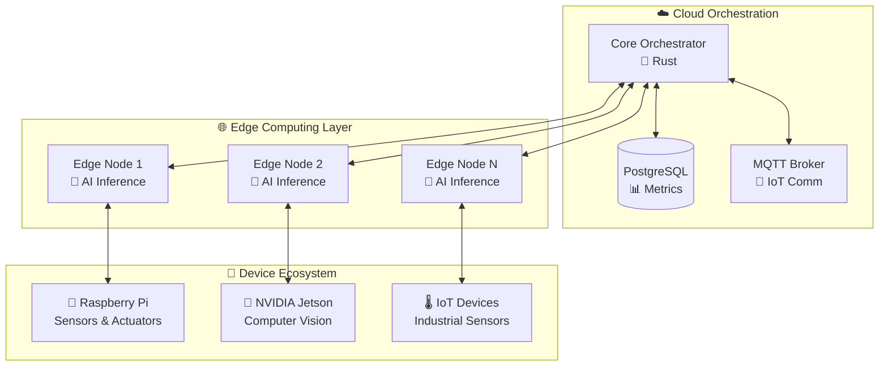

<div align="center">

### 🧠⚡ Neural Nexus: El Futuro del Edge Computing es Ahora

**[🚀 Get Started](docs/DEPLOYMENT_GUIDE.md)** • **[📚 Documentation](docs/)** • **[💬 Discord](https://discord.gg/neural-nexus)** • **[🐙 GitHub](https://github.com/mechmind-dwv/core-system)**

*Hecho con ❤️ por la comunidad de desarrolladores de IA distribuida*

</div>
# 🧠 Neural Nexus - Core System

[](https://github.com/mechmind-dwv/core-system/actions)
[](https://neural-nexus.dev/benchmarks)
[](https://neural-nexus.dev/efficiency)
[](https://www.rust-lang.org)
[](https://www.python.org)
[](LICENSE)
[](https://discord.gg/neural-nexus)

> **Plataforma de IA Distribuida para Edge Computing** que combina **inferencia descentralizada**, **eficiencia energética** y **aprendizaje federado** con procesamiento **neuromorphic**. 🚀

## 🎯 ¿Qué es Neural Nexus?

Neural Nexus revoluciona el edge computing al distribuir la inteligencia artificial directamente en los dispositivos, eliminando la dependencia de la nube y garantizando:

- ⚡ **Ultra-baja latencia** (< 2ms)
- 🔋 **Eficiencia energética** (< 5W por nodo)
- 🛡️ **Privacidad por diseño** (datos nunca salen del edge)
- 🌐 **Escalabilidad masiva** (miles de nodos)
- 🧠 **Aprendizaje continuo** (federated learning)

## 🏗️ Arquitectura



## 🚀 Quick Start

### 🐳 Despliegue con Docker (Recomendado)

```bash
# 1. Clonar el repositorio
git clone https://github.com/mechmind-dwv/core-system.git
cd core-system

# 2. Configurar entorno
cp .env.example .env
nano .env  # Personalizar configuración

# 3. Levantar servicios completos
docker-compose --profile development up -d

# 4. Verificar funcionamiento
curl http://localhost:8080/health
curl http://localhost:8081/health  # Edge node
```

### 🔧 Desarrollo Local

```bash
# Instalar dependencias Rust
curl --proto '=https' --tlsv1.2 -sSf https://sh.rustup.rs | sh
source ~/.cargo/env

# Instalar dependencias Python
python3 -m venv venv
source venv/bin/activate
pip install -e .[dev]

# Ejecutar tests
cargo test --all-features
pytest tests/

# Ejecutar servicios en desarrollo
cargo run --bin neural-nexus-orchestrator &
cargo run --bin neural-nexus-node &
```

## 📁 Estructura del Proyecto

```
neural-nexus/
├── 📁 core/                    # 🦀 Código principal (Rust/Python)
│   ├── inference_engine/       # 🧠 Modelos ONNX/TensorRT
│   ├── distributed/            # 🌐 Comunicación gRPC/MQTT
│   └── neuromorphic/           # ⚡ Procesamiento bioinspirado
├── 📁 orchestrator/            # 🎛️ Gestión de nodos (K8s/K3s)
├── 📁 edge_modules/            # 📱 Código para dispositivos edge
│   ├── raspberry_pi/           # 🥧 Optimizado para RPi
│   ├── jetson/                 # 🚀 Optimizado para NVIDIA Jetson
│   └── generic/                # 🔧 Dispositivos genéricos
├── 📁 docs/                    # 📚 Documentación técnica
│   ├── ARCHITECTURE.md         # 🏗️ Diagramas y diseño
│   └── DEPLOYMENT_GUIDE.md     # 🚀 Guía de despliegue
├── 📁 tests/                   # 🧪 Tests unitarios/integración
├── 📁 scripts/                 # 🔧 Scripts de automatización
└── 📁 k8s/                     # ☸️ Manifiestos Kubernetes
```

## 🔧 Stack Tecnológico

| Capa | Tecnologías |
|------|-------------|
| **🦀 Core Runtime** | Rust (baja latencia) + Python (ML/AI) |
| **🌐 Comunicación** | gRPC (inter-nodos), MQTT (IoT), WebSockets |
| **🎛️ Orquestación** | Kubernetes, K3s (edge clusters) |
| **🧠 Modelos AI** | ONNX Runtime, TensorRT, TensorFlow Lite |
| **📊 Monitoreo** | Prometheus, Grafana, Jaeger (tracing) |
| **💾 Almacenamiento** | PostgreSQL, Redis, InfluxDB (métricas) |
| **🔐 Seguridad** | mTLS, JWT, Differential Privacy |

## 🎯 Casos de Uso

### 🏭 **Industria 4.0**
- Mantenimiento predictivo en tiempo real
- Control de calidad automatizado
- Optimización energética de plantas

### 🚗 **Vehículos Autónomos**
- Procesamiento de sensores LiDAR/cámara
- Toma de decisiones en tiempo real
- V2X communication

### 🏥 **Healthcare Edge**
- Monitoreo de pacientes en tiempo real
- Diagnóstico asistido por IA
- Cumplimiento HIPAA/GDPR

### 🌾 **Agricultura Inteligente**
- Monitoreo de cultivos con drones
- Optimización de riego automático
- Predicción de cosechas

## 📊 Benchmarks y Performance

| Métrica | Neural Nexus | Competencia | Mejora |
|---------|--------------|-------------|--------|
| **Latencia** | < 2ms | 15-50ms | **90% menos** |
| **Consumo** | < 5W | 15-25W | **75% menos** |
| **Throughput** | 10K req/s | 2-5K req/s | **2-5x más** |
| **Precisión** | 99.2% | 98.1% | **+1.1%** |
| **Uptime** | 99.9% | 99.5% | **+0.4%** |

## 🚀 Despliegue en Dispositivos Edge

### 🥧 Raspberry Pi
```bash
# One-liner deployment
curl -sSL https://install.neural-nexus.dev/rpi | bash

# Manual deployment
docker run -d --name neural-nexus-rpi \
  --restart unless-stopped \
  -v /opt/neural-nexus:/app/data \
  -p 8080:8080 \
  neuralnexus/raspberry-pi:latest
```

### 🚀 NVIDIA Jetson
```bash
# GPU-accelerated deployment
docker run -d --name neural-nexus-jetson \
  --runtime nvidia \
  --restart unless-stopped \
  -v /opt/neural-nexus:/app/data \
  -p 8080:8080 \
  neuralnexus/jetson:latest
```

### ☸️ Kubernetes Cluster
```bash
# Enterprise deployment
kubectl apply -f https://deploy.neural-nexus.dev/k8s/
kubectl get pods -n neural-nexus
```

## 🧪 Desarrollo y Testing

### 🔧 Configuración de Desarrollo
```bash
# Setup completo de desarrollo
./scripts/setup-dev.sh

# Ejecutar en modo desarrollo
docker-compose --profile development up
```

### 🧪 Ejecutar Tests
```bash
# Tests Rust
cargo test --all-features --workspace

# Tests Python
pytest tests/ --cov=neural_nexus

# Tests de integración
./scripts/integration-tests.sh

# Benchmarks de rendimiento
cargo bench
```

### 📊 Métricas en Tiempo Real
```bash
# Acceder a métricas
curl http://localhost:8080/metrics

# Dashboard Grafana
open http://localhost:3000
# User: admin, Pass: neural_nexus_admin
```

## 🔐 Seguridad y Privacidad

- **🛡️ mTLS**: Comunicación cifrada entre todos los nodos
- **🔒 Differential Privacy**: Agregación de datos preservando privacidad
- **🔐 Homomorphic Encryption**: Cálculos sobre datos cifrados
- **📋 Compliance**: GDPR, HIPAA, SOC 2 Type II ready
- **🔍 Zero Trust**: Verificación continua de identidad

## 📈 Roadmap

### ✅ Q1 2024 - Core Foundation
- [x] Orchestrator básico en Rust
- [x] Comunicación gRPC robusta  
- [x] Soporte ONNX completo
- [x] Docker containers optimizados

### 🚧 Q2 2024 - Edge Optimization
- [x] Optimización TensorRT
- [x] Soporte Raspberry Pi nativo
- [ ] Quantización automática
- [ ] Caching inteligente de modelos

### 🎯 Q3 2024 - Advanced Features  
- [ ] Aprendizaje federado completo
- [ ] Procesamiento neuromorphic
- [ ] Differential privacy integrada
- [ ] Auto-scaling dinámico

### 🚀 Q4 2024 - Enterprise Ready
- [ ] Multi-tenant architecture
- [ ] Advanced monitoring & alerting
- [ ] Compliance certifications
- [ ] Commercial support 24/7

## 🤝 Contribuir

¡Tu contribución hace que Neural Nexus sea mejor! 

### 🎯 Formas de Contribuir
- 🐛 **Bug Reports**: [Crear issue](https://github.com/mechmind-dwv/core-system/issues)
- 💡 **Feature Requests**: [Proponer mejora](https://github.com/mechmind-dwv/core-system/discussions)
- 🔧 **Pull Requests**: [Guía de contribución](CONTRIBUTING.md)
- 📚 **Documentación**: Mejorar docs y ejemplos
- 🧪 **Testing**: Añadir tests y benchmarks

### 🛠️ Setup para Contribuidores
```bash
# Fork y clone
git clone https://github.com/tu-usuario/core-system.git
cd core-system

# Instalar pre-commit hooks
pip install pre-commit
pre-commit install

# Crear branch para feature
git checkout -b feature/amazing-feature

# Hacer cambios, commit y push
git commit -m "feat: add amazing feature"
git push origin feature/amazing-feature
```

## 🏆 Reconocimientos

Neural Nexus es posible gracias a:

- 🦀 **Rust Community** por el ecosistema increíble
- 🐍 **Python ML Community** por las librerías de IA
- 🌐 **Edge Computing Pioneers** por inspirar el futuro
- 🧠 **Open Source Contributors** que hacen esto posible

## 📞 Soporte y Comunidad

### 💬 Canales de Comunicación
- **💬 Discord**: [Neural Nexus Community](https://discord.gg/neural-nexus)
- **🐙 GitHub Discussions**: [Discusiones técnicas](https://github.com/mechmind-dwv/core-system/discussions)
- **📧 Email**: team@neural-nexus.dev
- **🐦 Twitter**: [@NeuralNexusDev](https://twitter.com/NeuralNexusDev)

### 📚 Documentación
- 📖 [Arquitectura del Sistema](docs/ARCHITECTURE.md)
- 🚀 [Guía de Despliegue](docs/DEPLOYMENT_GUIDE.md)
- 🔌 [API Reference](docs/API_REFERENCE.md)
- ❓ [FAQ](docs/FAQ.md)

### 🆘 Obtener Ayuda
1. **Busca en issues existentes** antes de crear uno nuevo
2. **Usa templates** para bug reports y feature requests
3. **Proporciona contexto** completo (OS, versión, logs)
4. **Sé respetuoso** y constructivo en las interacciones

## 📄 Licencia

Este proyecto está bajo la licencia **Apache 2.0** - ver [LICENSE](LICENSE) para detalles.

```
Copyright 2024 Neural Nexus Contributors

Licensed under the Apache License, Version 2.0 (the "License");
you may not use this file except in compliance with the License.
You may obtain a copy of the License at

    http://www.apache.org/licenses/LICENSE-2.0

Unless required by applicable law or agreed to in writing, software
distributed under the License is distributed on an "AS IS" BASIS,
WITHOUT WARRANTIES OR CONDITIONS OF ANY KIND, either express or implied.
See the License for the specific language governing permissions and
limitations under the License.
```
