<<<<<<< HEAD
# Neural Nexus: Plataforma de IA Distribuida para Edge Computing


# Core System 🚀  
*Descripción breve del proyecto.*  

## 📌 Objetivo  
- ¿Qué resuelve?  
- ¿Quién lo usa?  

## 🛠 Tecnologías  
- Python/Java/C++/etc.  
- Frameworks o librerías clave.  

## 🚀 Cómo Empezar  
```bash
git clone git@github.com:mechmind-dwv/core-system.git
cd core-system
pip install -r requirements.txt  # o npm install


---

### **¿Qué Necesitas Definir Ahora?**  
1. **Lenguaje/Tecnología Principal** → ¿Python, C++, Rust, JavaScript?  
2. **Scope** → ¿Es un módulo, un servicio, o un sistema completo?  
3. **¿Necesitas Integrar CI/CD?** → GitHub Actions, Docker, etc.  

**Ejemplo de Comandos para un Proyecto Python:**  
```bash
# Crear entorno virtual (opcional)
python -m venv venv
source venv/bin/activate  # Linux/Mac
venv\Scripts\activate     # Windows

# Instalar dependencias
pip install flask numpy pandas  # Ejemplo
pip freeze > requirements.txt

---

Opciones Avanzadas (Si Quieres)

    🌐 API REST: Usar FastAPI o Flask.

    🧪 Testing: Pytest + GitHub Actions.

    🐳 Docker: Para contenerizar el proyecto.

Dime qué te gustaría construir y te doy la guía exacta. ¡Esto es como elegir los ingredientes antes de cocinar! 🍳
(O si prefieres, dime "sorpresame" y te sugiero una estructura cool basada en robótica/automatización, ya que el repo está bajo mechmind-dwv) 😉
=======
# core-system
# **🌌 Neural Nexus**  
**El núcleo de tu universo de IA distribuida**  
*"Donde los modelos piensan en el borde, y las redes aprenden como un sistema nervioso."*  

<div align="center">
  
</div>

---

## **🛠️ Instalación en 3 Pasos**  
```bash
# Clona el universo (usa --recurse-submodules para los submódulos de hardware)
git clone --depth=1 https://github.com/mechmind-dwv/core-system.git && cd core-system

# Configura el entorno cósmico (Python/Rust)
make init  # Instala dependencias y compila protobufs

# Despliega un nodo edge (ejemplo para Jetson)
make deploy-edge DEVICE_TYPE="jetson_xavier"
```

---

## **🧠 Arquitectura del Sistema**  

```mermaid
flowchart TD
  A[Dispositivos Edge] -->|MQTT/Protobuf| B[Neural Nexus Core]
  B --> C{Orquestador}
  C -->|gRPC| D[Cloud Federated Learning]
  C -->|WebAssembly| E[Interfaz Holográfica]
  B --> F[(Base de Datos de Borde)]
```


---

## **🔥 Features Clave**  
| Módulo               | Tecnología          | Desempeño           |
|----------------------|---------------------|---------------------|
| **Motor de Inferencia** | Rust + ONNX Runtime | 2ms latency         |
| **Comunicación**     | gRPC-Web            | 10K msg/seg         |
| **Security**         | WebAuthn + TLS 1.3  | Zero-trust          |
| **Monitorización**   | Grafana Live        | 100K métricas/edge  |

---

## **🚀 Despliegue en tu Hardware**  
```python
# Ejemplo: Inicializar un nodo edge
from neural_nexus import EdgeNode

node = EdgeNode(
    device="nvidia_jetson",
    model="yolov8n-pose.onnx",
    telemetry=True
)
node.start()
```

**Soporta**:  
- NVIDIA Jetson  
- Raspberry Pi 5  
- Custom FPGAs  

---

## **📡 Comunicación entre Nodos**  
```rust
// Ejemplo en Rust: Envío de tensores entre edges
use neural_nexus_core::TensorWire;

let tensor_data = TensorWire::new()
    .with_protocol("protobuf")
    .compress("zstd");
```

---

## **📊 Métricas en Tiempo Real**  
```bash
# Monitorea el rendimiento del cluster
make monitor
```
  

---

## **🌐 Ecosistema Neural Nexus**  
1. **[MechBot 3.0](https://github.com/mechmind-dwv/mechbot-3x)** - Robots con NN integrado  
2. **[NeuroForge](https://github.com/mechmind-dwv/neuroforge)** - Entrenamiento federado  
3. **[EdgeViz](https://github.com/mechmind-dwv/edgeviz)** - Visualización 3D de nodos  

---

## **💡 Filosofía del Código**  
> *"Tu hardware es el cuerpo, Neural Nexus el sistema nervioso.  
> Nosotros proveemos las neuronas, tú defines los reflejos."*  

- **Principio 1**: Zero latency > 100% accuracy  
- **Principio 2**: Cada nodo es autosuficiente  
- **Principio 3**: La red aprende como un organismo  

---

## **🛡️ Licencia**  
```text
Copyright 2024 MechMind-DWV  

Licensed under the Apache License, Version 2.0 (the "License");
you may not use this file except in compliance with the License.
```

---

<div align="center">
    
  *"El edge no es un lugar... es un estado de la mente."*  
</div>

---

### **✨ ¿Listo para Contribuir?**  
1. **Discute** en nuestros [RFCs](https://github.com/mechmind-dwv/core-system/discussions/categories/rfcs)  
2. **Debuggea** con [Issue Hunter Mode](https://github.com/mechmind-dwv/core-system/issues?q=is%3Aopen+label%3A%22hunt+this%22)  
3. **Extiende** el core con [NeuroSDK](https://github.com/mechmind-dwv/neurosdk)  

```bash
# Usa este tag en tus commits:  
git commit -m "feat(nexus): [Descripción] | cosmic-level=[1-5]"
```

--- 

<sub>🔄 Actualización dinámica: Este README se auto-modifica con `make update-readme`</sub>  

<div align="center">
    
  
</div>
>>>>>>> 4a1949c (Add CI/CD workflow with proper formatting)
